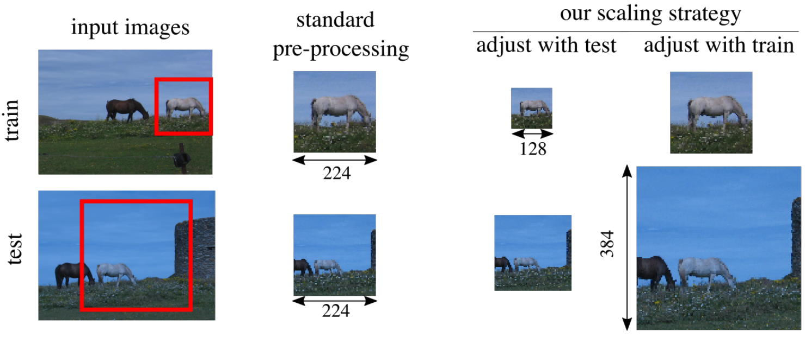

# FixRes



FixRes is a simple method for fixing the train-test resolution discrepancy. 
It can improve the performance of any convolutional neural network architecture.

The method is described in "Fixing the train-test resolution discrepancy" (Links: [arXiv](https://arxiv.org/abs/1906.06423),[NeurIPS](https://papers.nips.cc/paper/9035-fixing-the-train-test-resolution-discrepancy)). 

BibTeX reference to cite, if you use it:
```bibtex
@inproceedings{touvron2019FixRes,
       author = {Touvron, Hugo and Vedaldi, Andrea and Douze, Matthijs and J{\'e}gou, Herv{\'e}},
       title = {Fixing the train-test resolution discrepancy},
       booktitle = {Advances in Neural Information Processing Systems (NeurIPS)},
       year = {2019},
}
```

Please notice that our models depend on previous trained models, see [References to other models](#references-to-other-models) 

# Installation

The FixRes code requires
* Python 3.6 or higher
* PyTorch 1.0 or higher

and the requirements highlighted in [requirements.txt](requirements.txt) (for Anaconda)

# Cluster settings

Ours codes were executed on a cluster with several GPUs. As configurations are different from one cluster to another, we provide a generic implementation. You must run the code on each GPU by specifying job-id, local-rank, global-rank, and num-tasks which is not very convenient. Therefore, we strongly recommend to adapt our code according to the configuration of your cluster.

# Using the code 

The configurations given in the examples provide the results of the Pretrained Networks table (Table 2 in the article). 
The training and fine-tuning codes record the learned model in a checkpoint.pth file.

## Extracting features with pre-trained networks

### Pre-trained networks

We provide pre-trained networks with different trunks, we report in the table validation resolution, Top-1 and Top-5 accuracy on ImageNet validation set:

|  Models  | Resolution | #Parameters | Top-1 / Top-5 |                                        Weights                                         |
|:---:|:-:|:------------:|:------:|:---------------------------------------------------------------------------------------:|
|  ResNet-50 Baseline| 224 |     25.6M     |  77.0 /  93.4 | [FixResNet50_no_adaptation.pth](https://dl.fbaipublicfiles.com/FixRes_data/FixRes_Pretrained_Models/ResNet_no_adaptation.pth)  |
|  FixResNet-50 | 384 |    25.6M     |  79.0 / 94.6 |  [FixResNet50.pth](https://dl.fbaipublicfiles.com/FixRes_data/FixRes_Pretrained_Models/ResNetFinetune.pth)  |
|  FixResNet-50 (*)| 384 |    25.6M     |  79.1 / 94.6 |  [FixResNet50_v2.pth](https://dl.fbaipublicfiles.com/FixRes_data/FixRes_Pretrained_Models/ResNet50_v2.pth)  |
| FixResNet-50 CutMix | 320 |     25.6M     |  79.7 /  94.9 | [FixResNet50CutMix.pth](https://dl.fbaipublicfiles.com/FixRes_data/FixRes_Pretrained_Models/ResNetCutMix.pth)  |
| FixResNet-50 CutMix (*)| 320 |     25.6M     |  79.8 /  94.9 | [FixResNet50CutMix_v2.pth](https://dl.fbaipublicfiles.com/FixRes_data/FixRes_Pretrained_Models/ResNet50_CutMix_v2.pth)  |
| FixPNASNet-5 | 480 |     86.1M     |  83.7 /  96.8 | [FixPNASNet.pth](https://dl.fbaipublicfiles.com/FixRes_data/FixRes_Pretrained_Models/PNASNet.pth)  |
| FixResNeXt-101 32x48d | 320 | 829M |  86.3 / 97.9 |[FixResNeXt101_32x48d.pth](https://dl.fbaipublicfiles.com/FixRes_data/FixRes_Pretrained_Models/ResNeXt_101_32x48d.pth) |
| FixResNeXt-101 32x48d (*)| 320 | 829M |  86.4 / 98.0 |[FixResNeXt101_32x48d_v2.pth](https://dl.fbaipublicfiles.com/FixRes_data/FixRes_Pretrained_Models/ResNext101_32x48d_v2.pth) |
| FixEfficientNet-B0 (+)| 320 | 5.3M |  80.2 / 95.4 |[FixEfficientNet](README_FixEfficientNet.md) |
| FixEfficientNet-L2 (+)| 600 | 480M |  88.5 / 98.7 |[FixEfficientNet](README_FixEfficientNet.md) |

(*)  We use Horizontal flip, shifted Center Crop and color jittering for fine-tuning (described in [transforms_v2.py](transforms_v2.py))

(+) We report different results with our FixEfficientNet (see [FixEfficientNet](README_FixEfficientNet.md) for more details)

To load a network, use the following PyTorch code: 

```python
import torch
from .resnext_wsl import resnext101_32x48d_wsl

model=resnext101_32x48d_wsl(progress=True) # example with the ResNeXt-101 32x48d 

pretrained_dict=torch.load('ResNeXt101_32x48d.pth',map_location='cpu')['model']

model_dict = model.state_dict()
for k in model_dict.keys():
    if(('module.'+k) in pretrained_dict.keys()):
        model_dict[k]=pretrained_dict.get(('module.'+k))
model.load_state_dict(model_dict)
```
The network takes images in any resolution. 
A normalization pre-processing step is used, with mean `[0.485, 0.456, 0.406]`. 
and standard deviation `[0.229, 0.224, 0.225]` for ResNet-50 and ResNeXt-101 32x48d,
use  mean `[0.5, 0.5, 0.5]` and standard deviation `[0.5, 0.5, 0.5]` with PNASNet.
You can find the code in transforms.py.

### Features extracted from the ImageNet validation set

We provide the probabilities, embedding and [labels](https://dl.fbaipublicfiles.com/FixRes_data/FixRes_Extracted_Features/labels.npy) of each image in the ImageNet validation so that the results can be reproduced easily.

Embedding files are matrixes of size 50000 by 2048 for all models except for PNASNet where the size is 50000 by 4320, embeddings are extracted after the last spatial pooling. The softmax are matrixes of sizes 50000 by 1000 it representing the probability of each class for each image.

| Model | Softmax | Embedding |
|:---:|:------------------------------------------------------------:|:------------------------------------------------------------:|
| FixResNet-50|[FixResNet50_Softmax.npy](https://dl.fbaipublicfiles.com/FixRes_data/FixRes_Extracted_Features/ResNet50_softmax.npy) |[FixResNet50Embedding.npy](https://dl.fbaipublicfiles.com/FixRes_data/FixRes_Extracted_Features/ResNet50_embedding.npy) |
| FixResNet-50 (*)|[FixResNet50_Softmax_v2.npy](https://dl.fbaipublicfiles.com/FixRes_data/FixRes_Extracted_Features/ResNet50_softmax_v2.npy) |[FixResNet50Embedding_v2.npy](https://dl.fbaipublicfiles.com/FixRes_data/FixRes_Extracted_Features/ResNet50_embedding_v2.npy) |
| FixResNet-50 CutMix|[FixResNet50_CutMix_Softmax.npy](https://dl.fbaipublicfiles.com/FixRes_data/FixRes_Extracted_Features/ResNet50CutMix_softmax.npy) |[FixResNet50_CutMix_Embedding.npy](https://dl.fbaipublicfiles.com/FixRes_data/FixRes_Extracted_Features/ResNet50CutMix_embedding.npy) |
| FixResNet-50 CutMix (*)|[FixResNet50_CutMix_Softmax_v2.npy](https://dl.fbaipublicfiles.com/FixRes_data/FixRes_Extracted_Features/ResNet50CutMix_softmax_v2.npy) |[FixResNet50_CutMix_Embedding_v2.npy](https://dl.fbaipublicfiles.com/FixRes_data/FixRes_Extracted_Features/ResNet50CutMix_embedding_v2.npy) |
| FixPNASNet-5|[FixPNASNet_Softmax.npy](https://dl.fbaipublicfiles.com/FixRes_data/FixRes_Extracted_Features/PNASNet_softmax.npy) |[FixPNASNet_Embedding.npy](https://dl.fbaipublicfiles.com/FixRes_data/FixRes_Extracted_Features/PNASNet_embedding.npy) |
| FixResNeXt-101 32x48d|[FixResNeXt101_32x48d_Softmax.npy](https://dl.fbaipublicfiles.com/FixRes_data/FixRes_Extracted_Features/IGAM_Resnext101_32x48d_softmax.npy) |[FixResNeXt101_32x48d_Embedding.npy](https://dl.fbaipublicfiles.com/FixRes_data/FixRes_Extracted_Features/IGAM_Resnext101_32x48d_embedding.npy) |
| FixResNeXt-101 32x48d  (*)|[FixResNeXt101_32x48d_Softmax_v2.npy](https://dl.fbaipublicfiles.com/FixRes_data/FixRes_Extracted_Features/IGAM_Resnext101_32x48d_softmax_v2.npy) |[FixResNeXt101_32x48d_Embedding_v2.npy](https://dl.fbaipublicfiles.com/FixRes_data/FixRes_Extracted_Features/IGAM_Resnext101_32x48d_embedding_v2.npy) |

(*)  We use Horizontal flip, shifted Center Crop and color jittering for fine-tuning (described in [transforms_v2.py](transforms_v2.py))

## Evaluation of the networks

See help (`-h` flag) for detailed parameter list of each script before executing the code.
 

### Classification results

`main_evaluate_imnet.py` evaluates the network on standard benchmarks.

`main_evaluate_softmax.py` evaluates the network on ImageNet-val with already extracted softmax output. (Much faster to execute)

### Example evaluation procedure

```bash
# FixResNeXt-101 32x48d
python main_evaluate_imnet.py --input-size 320 --architecture 'IGAM_Resnext101_32x48d' --weight-path 'ResNext101_32x48d.pth'
# FixResNet-50
python main_evaluate_imnet.py --input-size 384 --architecture 'ResNet50' --weight-path 'ResNet50.pth'

#FixPNASNet-5
python main_evaluate_imnet.py --input-size 480 --architecture 'PNASNet' --weight-path 'PNASNet.pth'
```

The following code give results that corresponds to table 2 in the paper :

```bash
# FixResNeXt-101 32x48d
python main_evaluate_softmax.py --architecture 'IGAM_Resnext101_32x48d' --save-path 'where_softmax_and_labels_are_saved'

# FixPNASNet-5
python main_evaluate_softmax.py --architecture 'PNASNet' --save-path 'where_softmax_and_labels_are_saved'

# FixResNet50
python main_evaluate_softmax.py --architecture 'ResNet50' --save-path 'where_softmax_and_labels_are_saved'
```
### Features extraction

`main_extract.py` extract embedding, labels and probability with the networks.
 
### Example  extraction procedure

```bash
# FixResNeXt-101 32x48d
python main_extract.py --input-size 320 --architecture 'IGAM_Resnext101_32x48d' --weight-path 'ResNeXt101_32x48d.pth' --save-path 'where_output_will_be_save'
# FixResNet-50
python main_extract.py --input-size 384 --architecture 'ResNet50' --weight-path 'ResNet50.pth' --save-path 'where_output_will_be_save'

# FixPNASNet-5
python main_extract.py --input-size 480 --architecture 'PNASNet' --weight-path 'PNASNet.pth' --save-path 'where_output_will_be_save'
```

## Fine-tuning existing network  with our Method
 See help (`-h` flag) for detailed parameter list of each script before executing the code.
 
### Classifier and Batch-norm fine-tuning

`main_finetune.py` fine-tune the network on standard benchmarks.

### Example fine-tuning procedure

```bash
# FixResNeXt-101 32x48d
python main_finetune.py --input-size 320 --architecture 'IGAM_Resnext101_32x48d' --epochs 1 --batch 8 --num-tasks 32 --learning-rate 1e-3

# FixResNet-50
python main_finetune.py --input-size 384 --architecture 'ResNet50' --epochs 56 --batch 64 --num-tasks 8 --learning-rate 1e-3

# FixPNASNet-5
python main_finetune.py --input-size 480 --architecture 'PNASNet' --epochs 1 --batch 64 --num-tasks 8 --learning-rate 1e-4
```
### Using transforms_v2 for fine-tuning
To reproduce our best results we must use the data-augmentation of transforms_v2 and use almost the same parameters as for the classic data augmentation, the only changes are the learning rate which must be 1e-4 and the number of epochs which must be 11. For FixResNet-50 fine-tune you have to use 31 epochs and a learning rate of 1e-3 and for FixResNet-50 CutMix you have to use 11 epochs and a learning rate of 1e-3.
Here is how to use transforms_v2 :

```python
from torchvision import datasets
from .transforms_v2 import get_transforms

transform = get_transforms(input_size=Train_size,test_size=Test_size, kind='full', crop=True, need=('train', 'val'), backbone=None)
train_set = datasets.ImageFolder(train_path,transform=transform['val_train'])
test_set = datasets.ImageFolder(val_path,transform=transform['val_test'])
```

## Training 

 See help (`-h` flag) for detailed parameter list of each script before executing the code.

### Train ResNet-50 from scratch

`main_resnet50_scratch.py` Train ResNet-50 on standard benchmarks.

### Example training procedure

```bash
# ResNet50
python main_resnet50_scratch.py --batch 64 --num-tasks 8 --learning-rate 2e-2

```

## Contributing
See the [CONTRIBUTING](CONTRIBUTING.md) file for how to help out.

## References to other models

Model definition scripts are based on https://github.com/pytorch/vision/ and https://github.com/Cadene/pretrained-models.pytorch.

The Training from scratch implementation is based on https://github.com/facebookresearch/multigrain.

Our FixResNet-50 CutMix is fine-tune from the weights of the GitHub page : https://github.com/clovaai/CutMix-PyTorch.
The corresponding paper is 
```
@inproceedings{2019arXivCutMix,
       author = {Sangdoo Yun and Dongyoon Han and Seong Joon Oh and Sanghyuk Chun and Junsuk Choe and Youngjoon Yoo,
       title = "{CutMix: Regularization Strategy to Train Strong Classifiers with Localizable Features}",
       journal = {arXiv e-prints},
       year = "2019"}
```

Our FixResNeXt-101 32x48d is fine-tuned from the weights of the Pytorch Hub page : https://pytorch.org/hub/facebookresearch_WSL-Images_resnext/

The corresponding paper is 
```
@inproceedings{mahajan2018exploring,
       author = {Mahajan, Dhruv and Girshick, Ross and Ramanathan, Vignesh and He, Kaiming and Paluri, Manohar and Li, Yixuan  and Bharambe, Ashwin and van der Maaten, Laurens,
       title = "{Exploring the limits of weakly supervised pretraining}",
       journal = {European Conference on Computer Vision},
       year = "2018"}
```

For FixEfficientNet we used model definition scripts and pretrained weights from https://github.com/rwightman/pytorch-image-models.

The corresponding papers are:

For models with extra-training data :

```
@misc{xie2019selftraining,
	author={Qizhe Xie and Minh-Thang Luong and Eduard Hovy and Quoc V. Le,
    title="{Self-training with Noisy Student improves ImageNet classification}",
    journal = {arXiv e-prints},
    year=2019}
}
```

For models without extra-training data :

```
@misc{xie2019adversarial,
	author={Cihang Xie and Mingxing Tan and Boqing Gong and Jiang Wang and Alan Yuille and Quoc V. Le,
    title="{Adversarial Examples Improve Image Recognition}",
    journal = {arXiv e-prints},
    year="2019"}
}
```
## License
FixRes is [CC BY-NC 4.0](https://creativecommons.org/licenses/by-nc/4.0/) licensed, as found in the LICENSE file.
