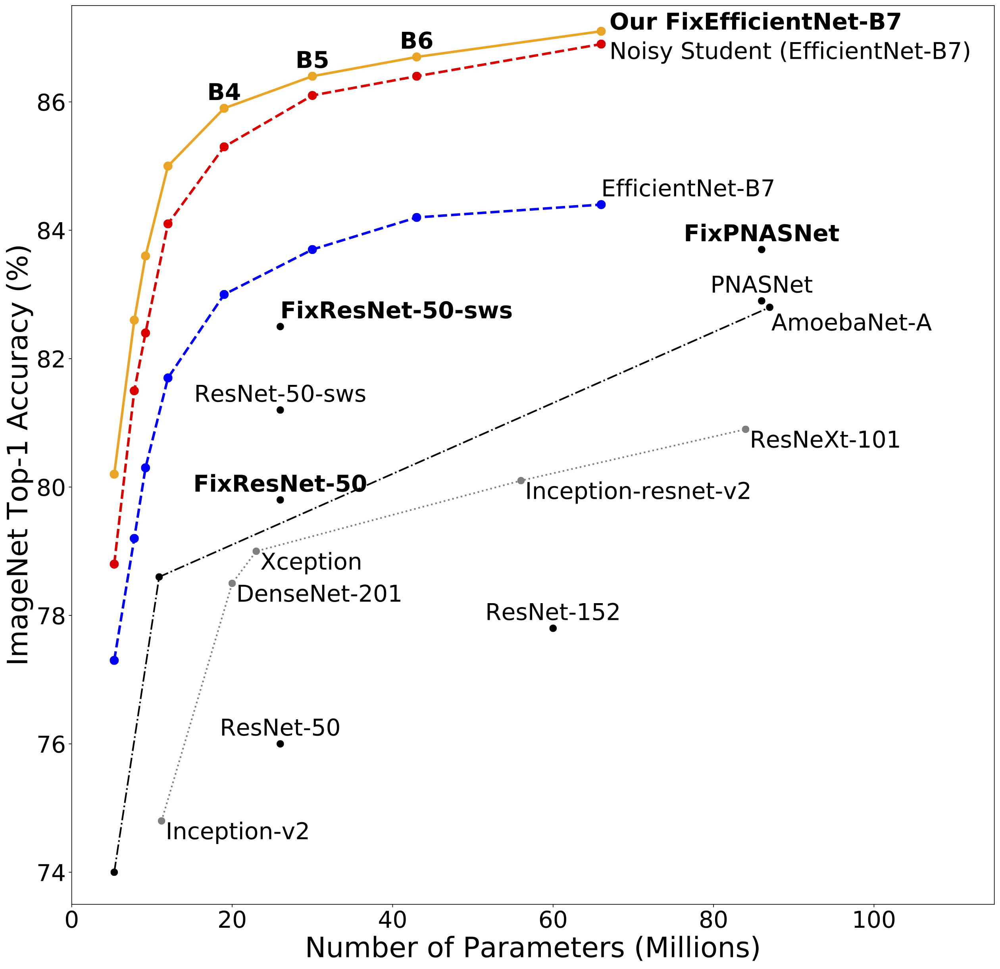

# FixEfficientNet

<p align="center">

</p>

[FixRes](https://github.com/facebookresearch/FixRes) is a simple method for fixing the train-test resolution discrepancy. 
It improves the performance of any convolutional neural network architecture. 
The method is described in the Neurips paper "[Fixing the train-test resolution discrepancy](https://papers.nips.cc/paper/9035-fixing-the-train-test-resolution-discrepancy)" ([More results on arXiv](https://arxiv.org/abs/1906.06423)). 

Hereafter we provide some results reported in [this note](https://arxiv.org/abs/2003.08237) for EfficientNet models. 
These models depend on and improve previous trained models, see the [references to other models](#references-to-other-models). 

## ImageNet Results

|  Models  | Resolution | #Parameters | Top-1 / Top-5 |  Extra training data            |
|:---:|:-:|:------------:|:------:|:-----:|
| FixEfficientNet-B0| 320 |     5.3M    |  79.3 /  94.6 |  |
| FixEfficientNet-B0| 320 |    5.3M     |  80.2 /  95.4 | x  |
| FixEfficientNet-B1| 384 |     7.8M    |   81.3 /  95.7 | |
| FixEfficientNet-B1| 384 |     7.8M    |  82.6 /  96.4 | x |
| FixEfficientNet-B2| 420 |     9.2M     |  82.0 /  96.0 |  |
| FixEfficientNet-B2| 420 |    9.2M     |  83.6 /  96.9 | x |
| FixEfficientNet-B3| 472 |     12M     |  83.0 /  96.4 |  |
| FixEfficientNet-B3| 472 |     12M     |  85.0 /  97.4 | x |
| FixEfficientNet-B4| 512 |    19M     |  84.0 /  97.0 |  |
| FixEfficientNet-B4| 472 |    19M      | 85.9 /  97.7 | x  |
| FixEfficientNet-B5| 576 |     30M    |  84.7 /  97.2 |   |
| FixEfficientNet-B5| 576 |     30M       |  86.4/  97.9 | x |
| FixEfficientNet-B6| 576 |     43M    |  84.9 /  97.3 |   |
| FixEfficientNet-B6| 680 |     43M      |  86.7 /  98.0 | x |
| FixEfficientNet-B7| 632 |     66M     |  85.3 /  97.4 |   |
| FixEfficientNet-B7| 632 |     66M    |  87.1 /  98.2 | x  |
| FixEfficientNet-B8| 800 |     87.4M   |  85.7 /  97.6 | |
| FixEfficientNet-L2| 600 |     480M     |  88.5 /  98.7 |x |

```bibtex
@inproceedings{touvron2019FixRes,
       author = {Touvron, Hugo and Vedaldi, Andrea and Douze, Matthijs and J{\'e}gou, Herv{\'e}},
       title = {Fixing the train-test resolution discrepancy},
       booktitle = {Advances in Neural Information Processing Systems (NeurIPS)},
       year = {2019},
}
```

```
@misc{touvron2020FixEfficientNet,
       author = {Touvron, Hugo and Vedaldi, Andrea and Douze, Matthijs and J{\'e}gou, Herv{\'e}},
       title = {Fixing the train-test resolution discrepancy: FixEfficientNet},
       journal={arXiv preprint arXiv:2003.08237},
       year = {2020},
}
```

## References to other models

Model definition scripts and pretrained weights are from https://github.com/rwightman/pytorch-image-models.

The corresponding papers are as follows. 

For models with extra-training data:

```
@misc{xie2019selftraining,
    author={Qizhe Xie and Minh-Thang Luong and Eduard Hovy and Quoc V. Le,
    title="{Self-training with Noisy Student improves ImageNet classification}",
    journal = {arXiv preprint arXiv:1911.04252},
    year=2019,
}
```

For models without extra-training data:

```
@misc{xie2019adversarial,
    author={Cihang Xie and Mingxing Tan and Boqing Gong and Jiang Wang and Alan Yuille and Quoc V. Le,
    title="{Adversarial Examples Improve Image Recognition}",
    journal = {arXiv preprint arXiv:1911.09665},
    year="2019",
}
```

```
@misc{tan2019efficientnet,
  author    = {Mingxing Tan and Quoc V. Le},
  title     = "{EfficientNet: Rethinking Model Scaling for Convolutional Neural Networks}",
  journal   = {arXiv preprint arXiv:1905.11946},
  year= "2019",
}
```

## License
FixRes is [CC BY-NC 4.0](https://creativecommons.org/licenses/by-nc/4.0/) licensed, as found in the LICENSE file.


